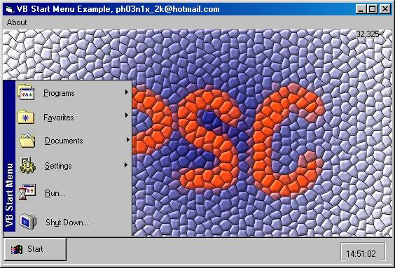



## VB Start Menu \!

### Description

A VB Start Menu that actually looks a little like the the windows one (check screen shot) I downloaded Itay Sagui 's code the other day and i thought it needed some updating (no offence Itay) i kept some of his code in there but its now more like a task bar with my own 'Run' form in as well, it's fully commented nearly everything is explained.

Please check it out, Leave comments & Vote.

(no laughing at my PSC logo hehe)
 
### More Info
 

             |
---                |---
**Submitted On**   |2000-08-03 18:28:56
**By**             |[Andrew Killer](https://github.com/Planet-Source-Code/PSCIndex/blob/master/ByAuthor/andrew-killer.md)
**Level**          |Beginner
**User Rating**    |3.4 (17 globes from 5 users)
**Compatibility**  |VB 5\.0, VB 6\.0
**Category**       |[Miscellaneous](https://github.com/Planet-Source-Code/PSCIndex/blob/master/ByCategory/miscellaneous__1-1.md)
**World**          |[Visual Basic](https://github.com/Planet-Source-Code/PSCIndex/blob/master/ByWorld/visual-basic.md)
**Archive File**   |[CODE\_UPLOAD8557832000\.zip](https://github.com/Planet-Source-Code/andrew-killer-vb-start-menu__1-10353/archive/master.zip)

